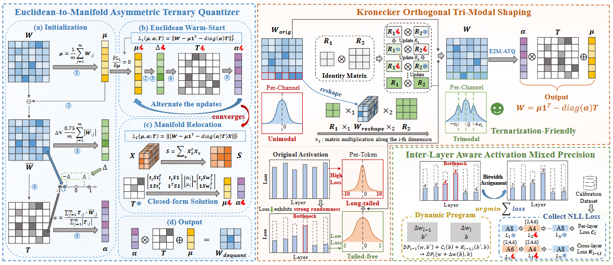
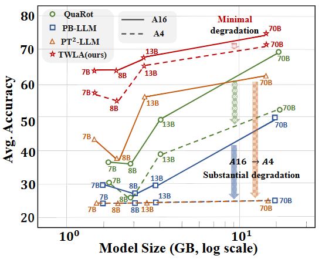
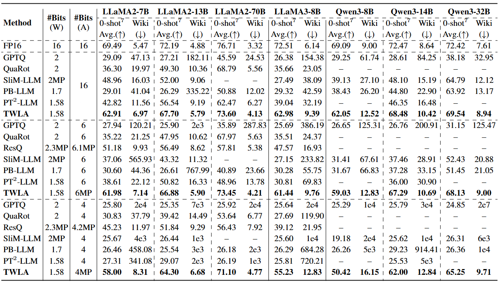

<div align="center">

# [ICML'26] TWLA: Achieving Ternary Weights and Low-Bit Activations for LLMs via Post-Training Quantization

[Zhixiong Zhao](https://kishon-zzx.github.io/)\*, Zukang Xu\*, Zhixuan Chen, Xing Hu, Zhe Jiang and Dawei Yang

<br>

<a href="" target="_blank">
</a>

<a href="https://github.com/Kishon-zzx/TWLA" target="_blank">
</a>

</div>

#### 🔥🔥🔥 News

- **2026-05-18:** Code is released. ⭐️⭐️⭐️
- **2026-05-01:** TWLA is accepted at ICML 2026. 🎉🎉🎉
- **2025-01-29:** This repo is released.

---

> **Abstract:** Large language models (LLMs) exhibit exceptional general language processing capabilities, but their memory and compute costs hinder deployment. Ternarization has emerged as a promising compression technique, offering significant reductions in model size and inference complexity. However, existing methods struggle with heavy-tailed activation distributions and therefore keep activations in high precision, fundamentally limiting end-to-end inference acceleration. 
To overcome this limitation, we propose **TWLA**, a post-training quantization (PTQ) framework that achieves 1.58-bit weight compression and 4-bit activation quantization while maintaining high accuracy. TWLA comprises three components: (1) Euclidean-to-Manifold Asymmetric Ternary Quantizer (E2M-ATQ) minimizes layer-output error under weight ternarization via a two-stage optimization from Euclidean initialization to manifold relocation; (2) Kronecker Orthogonal Tri-Modal Shaping (KOTMS) applies a Kronecker-structured orthogonal rotation to reshape weights into ternary-friendly tri-modal distributions, while the shared rotation statistically suppresses activation outliers; and (3) Inter-Layer Aware Activation Mixed Precision (ILA-AMP) explicitly introduces adjacent-layer second-order interaction costs in bit allocation and jointly optimizes for the layer-wise disparity of activation quantization gains induced by the shared orthogonal transform, preventing cascades triggered by a few weak layers.
Extensive experiments demonstrate that TWLA is a PTQ method that maintains high accuracy under the **W1.58A4** configuration, while delivering significant inference acceleration. The code is available at [TWLA](https://github.com/Kishon-zzx/TWLA).



---

Figure 1 in the main paper demonstrates that our proposed TWLA remains robust under both weight-only and weight–activation quantization (at equal memory cost), while other
methods degrade substantially with 4-bit activation quantization.

<p align="center">
  
</p>


## Dependencies

```bash
# Clone the github repo and go to the default directory 'TWLA'.
conda create -n twla python=3.9
conda activate twla
pip install torch torchvision torchaudio
pip install -r requirements.txt
```
## 🔗 Contents

1. [Post-training quantization and evaluation](#post-training-quantization)
2. [Results](#-results)
3. [Citation](#citation)
4. [Acknowledgements](#-acknowledgements)

## Post-training quantization with PPL evaluation (Example: Qwen3-8B)
### KOTMS
```bash
    python scripts/KOTMS.py \
    --model Qwen/Qwen3-8B \
    --export_rotated checkpoints/qwen3_8b_rotated.pt \
    --ngpus 4 \
    --use_gmm \
    --gmm_iters 100 \
    --gmm_lr_r 1e-2 \
    --gmm_lr_l 1e-2
```
### ILA-AMP
```bash
    python scripts/ILA_AMP.py \
    --model Qwen/Qwen3-8B \
    --import_rotated checkpoints/qwen3_8b_rotated.pt \
    --dp_cache dp_cache/qwen3_8b \
    --dp_ngpus 4
```
### Run-TWLA
#### Weight-only (W1.58A16)
```bash
    python run_twla.py \
    --model Qwen/Qwen3-8B \
    --import_rotated checkpoints/qwen3_8b_rotated.pt \
    --dp_cache dp_cache/qwen3_8b \
    --save_quant_model save_models/Qwen3-8B \
    --eval_qa \
    --abits 16
```
#### Weight-Activation (W1.58A4)
```bash
    python run_twla.py \
    --model Qwen/Qwen3-8B \
    --import_rotated checkpoints/qwen3_8b_rotated.pt \
    --dp_cache dp_cache/qwen3_8b \
    --load_quant_model save_models/Qwen3-8B \
    --eval_qa \
    --dp_avg_abits 4
```

## Evaluation on zero-shot QA datasets

We use [lm-evaluation-harness](https://github.com/EleutherAI/lm-evaluation-harness) kit to evaluate performance on QA datasets. Please refer to their framework for evaluating quantized models.

## 🔎 Results
<details>
<summary>TWLA achieves superior perplexity performance on WikiText2 datasets and superior average accuracy on 7 zero-shot QA datasets. (click to expand)</summary>

<p align="center">
  
</p>

</details>

## Citation

If you find the code helpful in your research or work, please cite the following paper.

```

```

## 💡 Acknowledgements

This work is released under the Apache 2.0 license.
The codes are based on [ARB-LLM](https://github.com/ZHITENGLI/ARB-LLM). Please also follow their licenses. Thanks for their awesome works.
