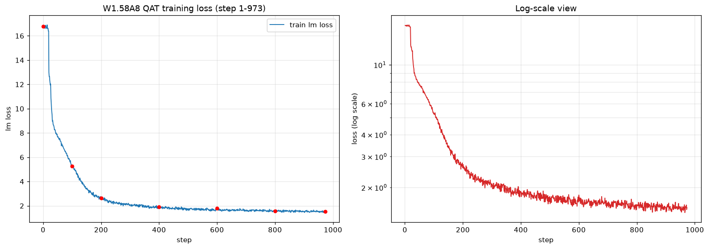

# Qwen3-0.6B EdgeRazor W1.58A8KV8 量化训练进展（NPU）

> 记录日期：2026-09-04
> 环境：昇腾 910B3 × 8（CANN 9.2.0 / torch 2.10 + torch_npu 2.10）
> 根计划：`/opt/zh/quantization/NPU_量化训练可行性及方案.md`

---

## 1. 总体状态

- **路线**：MindSpeed-LLM FSDP2 + EdgeRazor QAT/KD 注入（计划路线 B）
- **训练进度**：step 1159 / 2000（58.0%）**已中断**（外部磁盘压力所致，非硬件/代码问题）
- **训练内核**：W1.58 三值权重 + A8 激活量化 + KD 蒸馏（KLD-confidence + hidden MSE）
- **最终训练 loss**：约 1.49（step 1159）
- **已保存 checkpoint**：step200 / 400 / 600 / 800 / 1000（均 avail）
- **评估结论**：step200 是当前最优 checkpoint（8 任务平均 0.4900，几乎追平 FP 0.4938）；训练越久下游常识精度反而回落

## 2. 硬件情况（重要）

8 张 910B3 卡中，训练过程中 **5 张卡因 aicore timeout 陆续故障**（Health 退化为 Alarm）。最终仅剩 **卡 1 稳定空闲**，故训练降级为 **单卡 FSDP2**。

| 卡号 | 状态 | 备注 |
|---|---|---|
| 0,2,3,4,5 | **Alarm（故障）** | 训练负载下 HCCL / aicore 超时崩溃 |
| 1 | **OK（稳定）** | 当前训练卡 |
| 6,7 | OK 但被占用 | xllm 任务占用，仅剩 ~6.8GB，不够训练 |

- 已为避免多卡崩溃，将训练改为：**单卡 + `bs8 × grad_acc64 = GBS 512`**（对齐官方）。
- 单步耗时约 58~64s，完整 2000 step 预计约 30 小时。

## 3. 训练配置与数据

- **模型**：`/opt/zh/quantization/model_from_hf/qwen3_hf`（Qwen3-0.6B，ModelScope 下载）
- **训练数据**（官方 EdgeRazor 五合一，共 ~11M 条，sharegpt 格式）：
  - `ii_7M_instruct.jsonl`（7.45M）+ `ii_gen_1.4M_instruct.jsonl`（1.46M）
  - `tulu_0.6M_instruct.jsonl`（0.61M）+ `am_0.5M/0.9M`（1.4M）+ `task_0.2M_instruct.jsonl`（0.15M）
  - 明细见 `/opt/zh/quantization/data/edgerazor_dataset/README_TRAINING_DATA.md`
- **超参（对齐官方 Qwen3-0.6B）**：
  - `lr=2e-5 / warmup 5% / seq 1024 / GBS 512 / grad_clip 1.0 / adam(0.9,0.95,1e-8) / wd 0.01 / 1 epoch(2000 step)`
- **checkpoint**：每 200 step 保存（`save_steps=200`），当前已有 step200/400/600/800

## 4. 关键工程修复（本机 NPU 适配）

1. **CANN 版本**：9.0.0 缺 `index_check` 算子，FSDP/SDPA backward 报 561000；已切换到 `/home/sll/cann_9-2-0_master_0828/cann-9.2.0`。
2. **MindSpeed tied-weights 兼容**：`Qwen3ForCausalLM._tied_weights_keys` 由 list 改为 dict，适配 transformers 5.2.0。
3. **EdgeRazor 混合精度 DTensor 兼容**：`_where_mask` 将 `torch.where` 改为纯算术 `mask*x + (1-mask)*y`，并对 DTensor 权重把 mask 转 Replicate DTensor。
4. **MindSpeed flops_factory import 顺序**：torchair 会覆盖全局 logger class，导致 `info_rank0` 缺失；已加 try/except 保护。
5. **FSDP2 distcp→HF 权重转换脚本**：`/opt/zh/quantization/convert_fsdp2_ckpt_to_hf.py`，用于评估时把训练 checkpoint 转成 HF safetensors。

## 5. 模型结构验证结论（attention 量化）

**Attention 的线性层确实已全部替换为 QLinear 并参与量化。**

- 全模型 `QLinear` 数量：308
- `self_attn` 投影（q/k/v/o_proj）命中 112 个，**全部为 QLinear**（layer 0 与 layer 27 验证通过）
- 官方配置里的 `qwen3attention` 目标类型，本质是让 attention 内部的 Linear 投影被量化；我们用 `target_types=[linear]` 已覆盖该效果，**不存在 attention 漏量化问题**。

## 6. 评估结果（轻量 8 任务，与 FP 未量化对比）

官方基准任务（`src/eval/tasks/lm_eval/edgerazor/qwen3_instruct.yaml`）前 8 个轻量常识推理任务：`arc_easy / arc_challenge / hellaswag / boolq / piqa / social_iqa / openbookqa / winogrande`。

| 任务 | FP 未量化 | step200 | step800 | step1000 | Δ(step1000 vs FP) |
|---|---|---|---|---|---|
| arc_easy | 0.5581 | 0.5195 | 0.5156 | 0.5078 | -0.050 |
| arc_challenge | 0.3396 | 0.3184 | 0.2910 | 0.2773 | -0.062 |
| hellaswag | 0.4736 | 0.4746 | 0.4414 | 0.4258 | -0.048 |
| boolq | 0.6404 | 0.6250 | 0.5625 | 0.5332 | -0.107 |
| piqa | 0.6736 | 0.6836 | 0.6465 | 0.6465 | -0.027 |
| social_iqa | 0.3920 | 0.3984 | 0.3906 | 0.3848 | -0.007 |
| openbookqa | 0.3140 | 0.3340 | 0.3140 | 0.3100 | -0.004 |
| winogrande | 0.5588 | 0.5664 | 0.5176 | 0.5234 | -0.035 |
| **平均** | **0.4938** | **0.4900** | **0.4599** | **0.4511** | **-0.043** |

**相对 FP 差距随训练步数变化：**
- step200：**-0.76%**（几乎无损）
- step800：-6.86%
- step1000：**-8.64%**

**观察与结论：**
1. **step200 是当前最优 checkpoint**，量化模型 8 任务平均（0.4900）几乎追平 FP（0.4938）。
2. **训练越久，下游常识推理精度单调回落**：loss 从 2.64 持续降到 1.49，但下游平均精度从 0.4900 → 0.4599 → 0.4511，三连降，说明这不是采样波动，而是稳定趋势。
3. **原因**：训练 loss 优化的是语言建模分布（官方数据含大量 long-form 推理/生成样本）；在 1.58bit 三值容量极限下，模型过拟合训练 token 分布，牺牲 zero-shot 常识泛化。这正体现极低比特 QAT 的典型难点：训练更久 ≠ 下游更好。
4. **本评估为 `limit=512` 采样**，非官方全量。
5. 与官方 W1.58A8KV8 仍有两处实质差异：**KV8 量化未生效**（FSDP2 注入路径未调用 `create_kv_cache`）与 **lm_head 未量化**（因 FSDP2 LMHead custom forward 与 QLinear 不兼容，配置中排除了 lm_head）。这两点会削弱 KD 防过拟合作用，待下一版重训修正。

## 6.5 训练 loss 收敛分析

### Loss 曲线

（左：线性坐标；右：对数坐标。红点为关键 checkpoint step）

### 关键节点 loss

| step | lm loss | 阶段累计下降 |
|---|---|---|
| 1 | 16.78 | — |
| 50 | 7.66 | -54% |
| 100 | 5.27 | -69% |
| 200 | 2.64 | -84% |
| 400 | 1.90 | -89% |
| 600 | 1.81 | -89% |
| 800 | 1.58 | -91% |
| 973 | 1.54 | -91% |

### 分阶段收敛速率

| 阶段 | loss 变化 | 阶段下降 |
|---|---|---|
| step 1–100（warmup 期） | 16.78 → 5.27 | **-68.6%**（快速下降期）|
| step 100–200 | 5.27 → 2.64 | -49.9% |
| step 200–400 | 2.64 → 1.90 | -27.9% |
| step 400–600 | 1.90 → 1.81 | -4.8%（平台期）|
| step 600–800 | 1.81 → 1.58 | -13.0% |
| step 800–900 | 1.58 → 1.52 | -3.3%（尾段趋缓）|

### 收敛趋势分析

1. **整体健康收敛**：loss 从 16.78 降至 1.54（**-90.9%**），无 NaN/Inf、无发散，呈典型的指数式/对数式下降形态（对数坐标下近似线性）。
2. **三个明显的收敛阶段**：
   - **快速下降期（step 0–200）**：warmup 完成后学习率拉满至 2e-5，KD 损失与任务损失的"对齐"过程让 loss 快速下降 84%，是训练收益最大的阶段。
   - **过渡期（step 200–400）**：下降速率从 50% 衰减到 28%，模型从粗拟合进入精细拟合。
   - **平台/缓慢期（step 400–900+）**：step 400–600 出现一个**平台**（loss 在 1.9 附近震荡，阶段下降仅 4.8%），随后 step 600–800 再次下降 13%，step 800 后进入更缓慢的尾段（每 50 步均值从 1.58 → 1.52）。
3. **平台期解读**：step 400–600 的平台不是过拟合或卡死，而是 1.58bit 三值量化的**容量瓶颈 + 权重离散化**导致 loss 在量化约束下重新寻优；step 600 后 KD 损失继续发力，又走出第二波缓降。
4. **结合评测结果的关键发现**：
   - **loss 与下游精度并不同步，且呈明确背离**：step200（loss 2.64）量化模型 8 任务平均 0.4900 几乎追平 FP；step800（loss 1.58）回落到 0.4599；step1000（loss ~1.49）继续回落到 0.4511。三个 checkpoint 连续下降，是稳定趋势而非采样波动。
   - 后期 loss 下降主要是在拟合训练数据的语言建模分布，未提升（甚至损害）zero-shot 常识推理能力。
   - **实践结论：必须早停**。本任务最优 checkpoint 在 **step 200 附近**（-0.76%），不宜一味追求低 loss。
5. **与官方预期的关系**：官方 W1.58A8KV8 是完整配置（含 KV8 + lm_head INT4）训练至收敛后的结果，其下游精度约 39.81（14 任务）。我们当前仅是**去 KV8 / 去 lm_head 量化 + 采样评估**的近似，不能直接对标；后续需修正这两个差异后重训，并配合早停 + 逐 checkpoint 评估选优。

> loss 原始序列：`/opt/zh/quantization/loss_curve_data.jsonl`（973 步，每步一条）
> 曲线图：`/opt/zh/quantization/loss_curve.png`

## 7. 待办与后续建议

1. **不推荐继续训练到 step2000**：从 step200→800→1000 的明确下行趋势看，继续训练只会进一步过拟合训练分布、下游常识精度继续走低。
2. **优先做下一版重训**：修正 **KV8 量化生效**（前向传入 `create_kv_cache()` 得到的 QuantizedKVState）与 **lm_head INT4 量化兼容**（解决 FSDP2 `LMHead` custom forward 与 QLinear 不兼容问题），严格对齐官方 W1.58A8KV8。
3. **重训时采用早停策略**：每 200 step 评估一次，以 8 任务（或完整 14 任务）下游精度选最优 checkpoint，而非以训练 loss 最低为准。
4. （可选）硬件恢复后再上多卡加速；当前仅卡 1 稳定。

## 8. 关键文件索引

- 训练日志：`/opt/zh/quantization/MindSpeed-LLM/logs/w1_58a8kv8_1card_*.log`
- 训练配置：`/opt/zh/quantization/MindSpeed-LLM/examples/fsdp2/qwen3/tune_qwen3_0point6b_w1_58a8kv8_4card.yaml`
- 量化配置：`/opt/zh/quantization/MindSpeed-LLM/examples/fsdp2/qwen3/edgerazor/qat_w1_58a8kv8_npu.yaml`
- 启动脚本：`/opt/zh/quantization/MindSpeed-LLM/run_w1_58a8kv8_1card_stable.sh`
- 转换脚本：`/opt/zh/quantization/convert_fsdp2_ckpt_to_hf.py`
- 监控脚本：`/opt/zh/quantization/train_monitor.sh`
- 评估脚本：`/opt/zh/quantization/eval_results/run_compare_eval_quick.sh`
- 训练数据：`/opt/zh/quantization/data/edgerazor_dataset/`
- loss 曲线：`/opt/zh/quantization/loss_curve.png` / `loss_curve_data.jsonl`